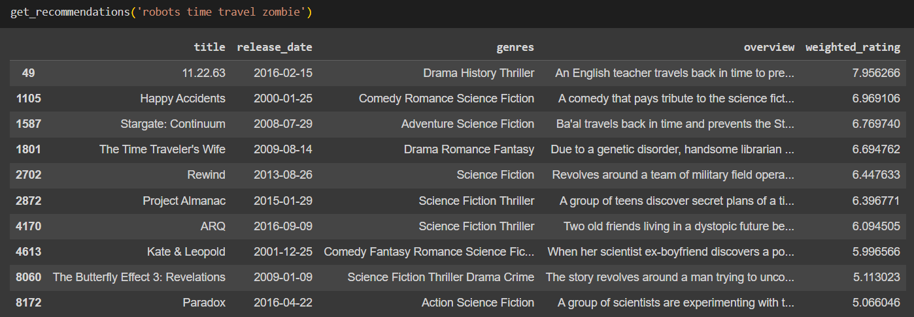

# Movie Search Engine

**Team Members**: Daniel Guzman, Gozde Karamanoglu, Harvey Zhang, Jake Li, Jeffrey Lai, Kevin Camacho

**Goal**: We want to create a movie search engine based on user text search. In most streaming websites, users can only filter categorically based on genre, year, producer, etc. Another common way is to search for movie titles directly. Currently, we don’t have methods for users to enter what they want to watch and populate results based on that. Our end product will solve this problem and allow users to search for movies in a new and interesting way.

## :mag_right: Data Source: [The Movies Dataset](https://www.kaggle.com/datasets/rounakbanik/the-movies-dataset?select=movies_metadata.csv)
This dataset includes the metadata for all 45,000 movies listed in the Full MovieLens Dataset.

## :open_book: Summary

1. Import data and exploratory data analysis.
2. Data cleaning and merged 3 dataframes.
3. Data visualization
4. Text preprocessing
5. Build movie recommendation algorithm using cosine similarity.

## :dart: Results

## :hammer_and_wrench: Tech Stack

**Language:** Python

**Libraries:** Numpy, Pandas, re, wordcloud, Matplotlib, Seaborn, NLTK, Scikit-learn

**Tool:** Google Colab
